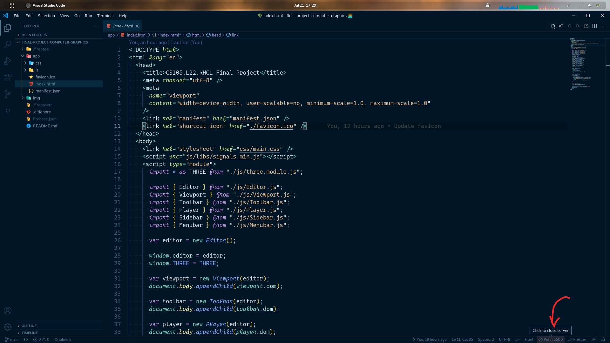

# CS105.L22.KHCL

## Thành viên

- Trần Hoàng Sơn - 18521351
- Phạm Ngọc Trường - 18521571
- Nguyễn Trường Thịnh - 18521447

## Live demo

👉 https://cs105-final-project.web.app/ 👈
## Hướng dẫn cài đặt

### Cách 1 (Tận dụng VSCode)

1. Tải repo này về máy (`git clone https://github.com/thinhntr/final-project-computer-graphics.git`) và mở repo này trong **VSCode**

1. Cài extension `Live Server` bởi _Ritwick Dey_
   

1. Mở file `index.html` trong thư mục `app`

1. Ấn nút **Go live** trong thanh Status Bar ở cuối VSCode
   

1. Lúc này VSCode sẽ tự khởi động ứng dụng trong trình duyệt mặc định của bạn

1. Để shutdown server của ứng dụng thì nhấn vào nút **Port: xxxx** trong VSCode (`xxxx` là port hiện tại của ứng dụng)

### Cách 2

1. Tải và cài đặt NodeJS tại đây https://nodejs.org/en/download/

1. Mở Terminal (Command Line) và chạy lệnh `npm install serve -g` để cài package **serve** từ npm

1. Tải repo này về máy (`git clone https://github.com/thinhntr/final-project-computer-graphics.git`)

1. Di chuyển đến repo này trong Terminal (vd: `cd ~/final-project-computer-graphics`)

1. Khởi động ứng dụng bằng cách chạy lệnh sau `serve -s app`

1. Mở browser và truy cập vào đường link mà lệnh `serve` vừa trả về

1. Để shutdown server của ứng dụng thì chỉ cần tắt Terminal lúc nãy ta dùng để khởi động hoặc ấn tổ hợp `Ctrl + C` trong terminal
